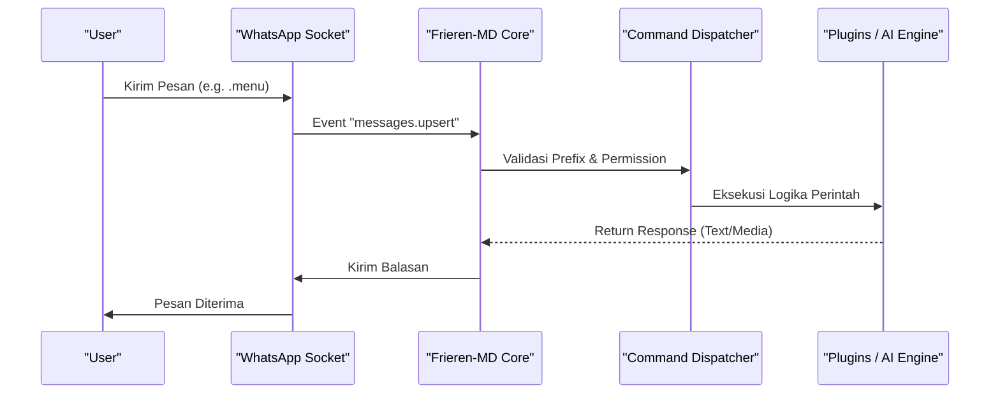
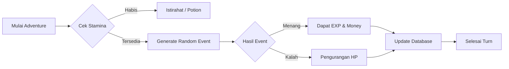
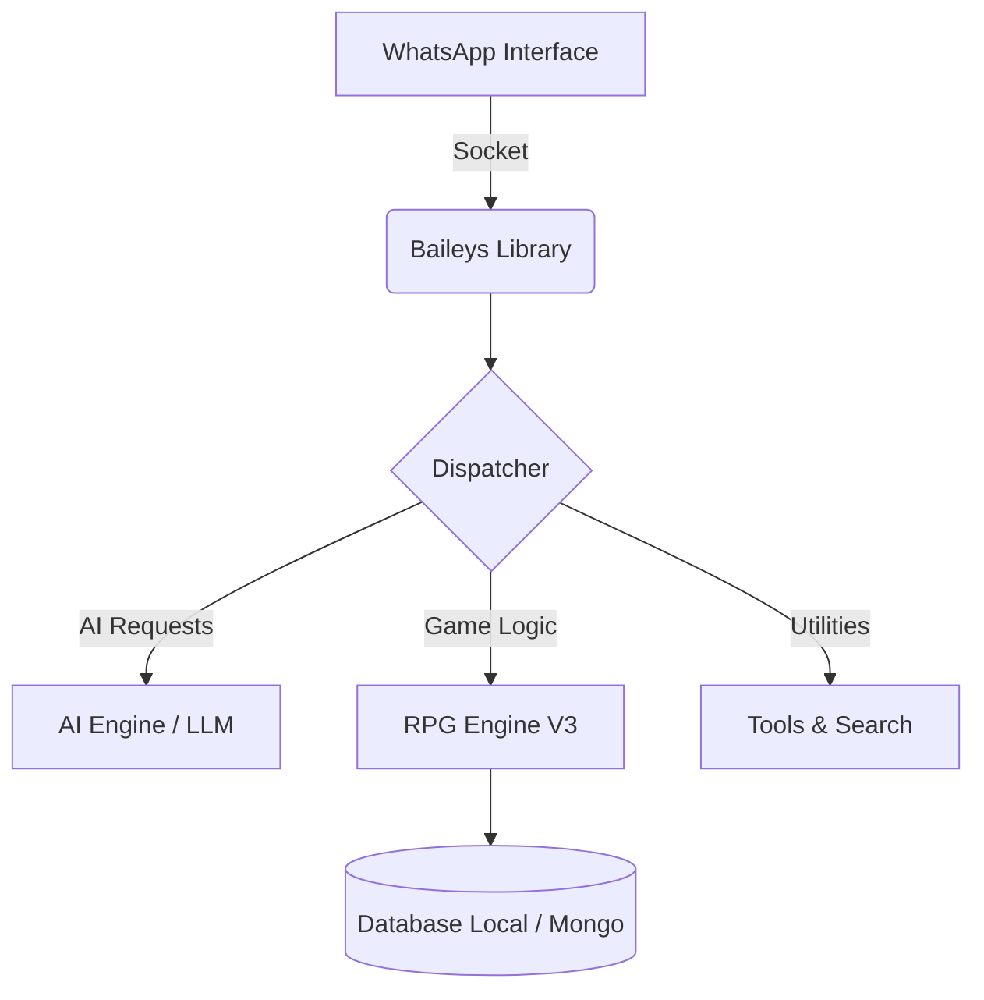

<!-- Header with Animation -->
<p align="center">
  
</p>

<!-- Dynamic Typing Animation -->
<p align="center">
  <a href="https://git.io/typing-svg">
    
  </a>
</p>

<!-- Badges -->
<p align="center">
  
  
  
  
</p>

---

## 🌿 The Mage's Journey: Frieren-MD

**Frieren-MD** adalah asisten digital canggih yang dirancang dengan filosofi "umur panjang" dan "efisiensi". Dibangun di atas arsitektur modular, bot ini menggabungkan kecerdasan buatan (AI) yang mendalam dengan ekosistem RPG yang kaya, memberikan pengalaman interaktif yang belum pernah ada sebelumnya di WhatsApp.

### ✨ Kenapa Memilih Frieren-MD?

- **Modular Architecture**: Mudah dimodifikasi dan dikembangkan oleh siapa saja.
- **Intelligent AI**: Didukung oleh logika AI yang fleksibel dan responsif.
- **RPG System V3**: Petualangan tanpa henti dengan sistem ekonomi, level, dan item.
- **Lightweight**: Dioptimalkan untuk berjalan lancar bahkan di server spesifikasi rendah.

---

## ⚔️ Arsitektur Sistem RPG V3

Sistem RPG telah dioptimalkan agar lebih responsif dan adiktif.

| Fitur             | Deskripsi                                                         |
| :---------------- | :---------------------------------------------------------------- |
| **Bounty Hunter** | Buru pemain dengan kriminalitas tinggi dan klaim hadiahnya.       |
| **Job System**    | Pilih peran sebagai Warrior, Thief, atau Farmer untuk bonus unik. |
| **Alchemy**       | Racik berbagai potion dan bahan langka untuk bertahan di Dungeon. |
| **Pet Companion** | Pelihara makhluk mistis yang akan membantumu dalam pertempuran.   |

---

## 🚀 Memulai Instalasi

Pastikan Anda telah menginstal **Node.js v18+** dan **Git** di sistem Anda.

### 🛠️ Langkah Cepat

```bash
# Clone repository
git clone https://github.com/Har404-err/frieren-md.git

# Masuk ke direktori
cd frieren-md

# Instal dependensi
npm install

# Jalankan bot
npm start
```

---

## 🏗️ Arsitektur & Alur Kerja

### 1. Sistem Dispatcher (Penerima Pesan)

Diagram ini menjelaskan bagaimana **Frieren-MD** memproses setiap pesan yang masuk.



### 2. Siklus Petualangan RPG V3

Logika di balik sistem RPG yang memastikan permainan tetap seimbang.



### 3. Struktur Proyek (Modular)

Pemisahan tanggung jawab antar komponen sistem.



---

## 🚩 Melaporkan Masalah (Issues)

Jika Anda menemukan bug, error, atau memiliki saran fitur, silakan laporkan melalui halaman **[Issues](https://github.com/Har404-err/frieren-md/issues)** di GitHub. Kami akan sangat menghargai laporan yang detail agar masalah dapat segera diatasi.

---

## 🤝 Kontribusi & Dukungan

Kami sangat terbuka untuk kontribusi! Frieren-MD adalah proyek komunitas, dan bantuan Anda sangat berarti.

### 🍴 Cara Fork & Kustomisasi

1.  **Fork** repository ini ke akun GitHub Anda.
2.  **Clone** hasil fork Anda ke lokal.
3.  Lakukan perubahan atau tambahkan fitur baru.
4.  **Push** ke repository fork Anda.
5.  Ajukan **Pull Request** (PR) jika ingin fitur tersebut digabungkan ke repository utama.

### ✨ Dukung Proyek Ini

Jika Anda menyukai bot ini, pertimbangkan untuk memberikan **Star ⭐** pada repository ini sebagai bentuk dukungan!

---

## 👥 Developer & Tim

<p align="center">
  <a href="https://github.com/Har404-err">
    
  </a>
</p>

---

<p align="center">
  
</p>
